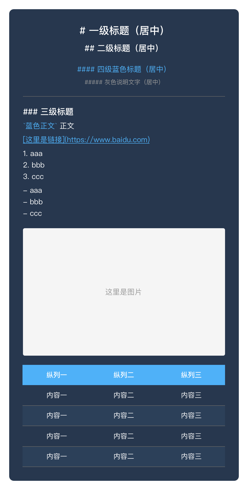

# WeGene 微解读专业版（轻应用）开发者文档 #

### 版本：1.0 ###

---

#### 1. 说明 ####

轻应用是 WeGene 为生物信息开发者提供的轻量级基因应用的开发引擎，帮助生物信息开发者在不使用 WeGene 开放平台 API 的情况下利用脚本语言来直接开发各种基因数据分析应用并相应部署到 WeGene 平台上。开发者可以为自己的应用设定价格，当用户使用时可以获取相应的报酬并提现。目前，轻应用支持 `Python 2.7`、`Python 3.6` 及 `R` 语言。

---

#### 2. 名词定义 ####

- 轻应用：部署在 WeGene 服务端、入口在 WeGene 平台上的一个应用
- 平台：WeGene，可狭义理解为 WeGene 的用户网站、APP等平台
- 开发者：一个轻应用的开发者
- 用户：一个轻应用的使用者，同时该使用者也是 WeGene 自身的用户

---

#### 3. 架构 ####

一个典型的轻应用共分为 3 个部分：1）输入；2）计算；3）输出。输入数据由平台直接根据开发者在申请轻应用时要求的数据，得到用户授权同意后利用其已经存在于平台上的基因数据生成并输入。输入数据经由开发者自定义的计算脚本进行计算，并从脚本输出结果。该输出结果被平台读取后，将会被渲染成用户可见的结果页面。

简而言之，开发者在整个轻应用的开发中，只需专注一件事：**开发核心的基因数据分析算法和脚本**。该脚本只需按一定的规则处理输入、输出即可。需要注意的是，计算过程中不可使用任何网络资源。

---

#### 4. 工程架构  ####

下面介绍如何开发一个轻应用。附件 `weapp_example_python.zip` 与 `weapp_example_r.zip` 为相应的工程文件。

一个可以被在平台上被部署的轻应用必须是打包为 `.zip` 的代码包，其中包含如下的内容：

- （必选）主计算脚本 `main.py` 或 `main.R` - 轻应用执行的主体，需要读取输入、进行计算、输出结果。**整个轻应用的计算过程目前需要在 120 秒内完成。**
- （可选）依赖代码 - 如果主计算脚本依赖其他开发者自定义的依赖代码，这些代码可以被存储在其他代码文件中。开发者只需要在主计算脚本中通过相应的**相对路径**进行引入。
- （可选）第三方依赖包定义文件 `requirements.txt`（Python） 或 `pacman.R`（R）- 如果轻应用依赖其他的第三方包，开发者只需要将所需的依赖按各自语言的依赖定义文件上传即可（无需上传实际依赖文件）。目前，Python 开发的轻应用使用 [pip](https://pip.pypa.io/en/stable/user_guide/#requirements-files) 进行包管理，R 开发的轻应用使用 [pacman](https://github.com/trinker/pacman) 进行包管理。
- （可选）参考文件 - 如果轻应用计算需要任何参考文件，同样只需要在代码中通过相应的**相对路径**引入即可。

**请注意，上述的文件在打包时，不要包含上一级的目录，即直接将所有的文件全选打包**

下面是两个轻应用工程的典型构成：

`Python`

```
weapp_example_python.zip
├── indexes (参考文件)
│   └── index_wegene_affy_2.idx
├── main.py （主计算脚本）
├── requirements.txt （第三方依赖包定义文件）
└── wegene_utils.py （依赖代码）
```

`R`

```
weapp_example_r.zip
├── indexes
│   └── index_wegene_affy_2.idx  (参考文件)
├── main.R （主计算脚本）
├── pacman.R （第三方依赖包定义文件）
└── wegene_utils.R （依赖代码）
```

**请注意，使用 R 语言时脚本文件的后缀名`.R`必须为大写字母。**


#### 4.1 主计算脚本 ####

主计算脚本需要获取输入、计算、输入输出。其中，输入必须通过 `stdin` 获取而输出需要通过 `stdout` 输出。输入会以 `json` 格式输入（见后文），而输出可以是纯文本或以**Markdown**格式输出的富文本。如果在计算的过程中遇到任何错误，则需要在 `stderr` 中抛出。在获取输入和打出输出之间是轻应用核心的计算逻辑。下面是主计算脚本在 Python 和 R 中的例子：

`main.py`

```python
# 永远从 stdin 读取输入
body = sys.stdin.read()

try:
	# 解析输入的 json 数据
    inputs = json.loads(body)['inputs']

   # 开始进行数据分析和计算
    result = do_something(inputs)

   # 输出结果
    print(result)
except Exception as e:
    # 输出计算过程中的异常
    sys.stderr.write(e.message)
    exit(2)
```

`main.R`

```r-language
# 永远从 stdin 读取输入
body <- readLines(file('stdin', 'r'), warn = F)

tryCatch({
	# 解析输入的 json 数据
    inputs <- fromJSON(json_str = body)

   # 开始进行数据分析和计算
    result <- do_something(inputs)

   # 输出结果，使用 cat 而不是 print，这样结果中不会有行数被打印
    cat(result)
}, error = function(e) {
    # 输出计算过程中的异常
    write(conditionMessage(e), stderr())
})
```

**重要：在整个结算结果中，只能够 `print/cat` 一次，因为轻应用会默认以第一条输出的结论作为整个应用的结论并且不会继续执行下去。如果你有多个结论要打印，可以使用单一的结果变量保存后一次性输出。**

**与此同时，计算过程中打印出的结论或异常信息有可能对用户可见，请以对用户友好的形式输出。例如，如果输入的数据不全，打印 `很抱歉，您的部分数据缺失，暂时无法计算`，而非`data missing xxxx`**

**重要：请注意，如果您需要创建收费应用，任何用户不能正常使用的情况（比如某些位点信息缺失无法获取结论、不支持某些芯片格式等，需要从 `stderr` 中输出，不可在 print 中输出，否则将不能通过审核）。**

**为了方便测试从`body = sys.stdin.read()`或`body <- readLines(file('stdin', 'r'), warn = F, n = 1)`开始的全部流程，为避免开发者需要每次都提交构建后再测试，开发者可以根据我们提供的测试数据模拟生成一份应用需要的输入数据`demo.json`，并通过命令`cat demo.json | python main.py` 或 `cat demo.json | Rscript main.R` 来本地进行模拟测试**

#### 4.2 第三方依赖 ####

第三方依赖通过定义文件定义，凡是在定义文件中定义过的依赖包，均可以被轻应用使用。轻应用代码中不可引入没有定义的第三方依赖。

`requirements.txt`

```text
numpy==1.11.2
scipy==0.18.1
```

`pacman.R`

```
pacman::p_load(base64enc, R.utils, rjson)
```

然后可以在计算脚本中引入这些依赖——

`main.py`

```python
import numpy
import scipy
```

`main.R`

```
# 引入依赖时需要禁用警告，否则会生成额外的错误日志
suppressMessages(library(base64enc))
suppressMessages(library(R.utils))
suppressMessages(library(rjson))
```

#### 4.3 输入参数 ####

在 ***4.1*** 中我们提到，通过 `stdin` 传入给轻应用的参数永远是 `json` 格式的数据，并且数据存储在`inputs` field当中。`inputs` 中传入的数据由创建应用时选择的入参决定，可能的值有——

| 字段名 | 字段说明 | 举例 | 值选项 |
|:-----:|:----:|:----:|:----:|
| format | 基因数据的格式 | `"format": "wegene_affy_2"` | `wegene_affy_2`, `wegene_fire_2`, `wegene_wgs_1`, `23andme`, `23andme_5`, `ancestry`, `ancestry_2`, `ancestry_3` |
| data | `gzip` 压缩并经过了 `base64` 编码的全部位点数据，需要配合`index`文件解析 | `"data": "xfgakljdflkja..."` | |
| RSxxxxx | 某个RS位点上的基因型数据，**请注意：`RS`为大写，且在请求的某个位点没有检测（非未检出）的情况下，不会被返回** | `"RS671": "AA"（正常返回）`、`"RS672": "--"（未检出）`, `"RS673": "__" （未检测，仅针对23andme格式数据）` | |
| sex | 性别 | `"sex": 1` | `0`（缺失）, `1`（男）, `2`（女） |
| age | 年龄数据 | `"age": 27` | 用户填写的年龄，如果大于`100`说明用户未填写 | |
| haplogroup | 单倍群 | 男性：`"haplogroup": {"y": {"haplogroup": "O2a1c1a"}, "mt": {"haplogroup": "M10a1a"}}`, 女性：`"haplogroup": {"mt": {"haplogroup": "M10a1a"}}` | 有 `mt`、`y`两个单倍群数据，女性无 `y` 字段 |
| ancestry | 祖源 | `"ancestry": {"block": {"xxx": "0.25"}, "area": {"xxx": "0.2"}}` | `block` 为大区域祖源数据，`area` 为小区域祖源数据，值存储为字符串格式 |

- 祖源数据中，各大区域的可能值如下表——

| 字段名 | 字段说明 |
|:-----:|:----:|
| chinese_nation | 中华民族 |
| ne_asian | 东北亚 |
| se_asian | 东南亚 |
| south_asian | 南亚 |
| central_asian | 中亚 |
| middle_eastern | 中东 |
| african | 非洲 |
| european | 欧洲 |
| american | 美洲 |
| oceanian | 大洋洲 |

- 祖源数据中，各小区域的可能值如下表——

| 字段名 | 字段说明 |
|:-----:|:----:|
| han_southern | 南方汉族 |
| han_northern | 北方汉族 |
| dai | 傣族 |
| tungus | 通古斯族群 |
| lahu | 拉祜族 |
| she | 畲族 |
| miao_yao | 苗瑶语族群 |
| mongolian | 蒙古语族群 |
| uygur | 维吾尔族 |
| tibetan | 藏族 |
| gaoshan | 高山族群 |
| ny | 纳西/彝族 |
| korean | 韩国人 |
| japanese | 日本人 |
| yakut | 雅库特人 |
| thai | 泰国人 |
| cambodian | 柬埔寨人 |
| kinh | 越南京族 |
| mala | 印度人 |
| bengali | 孟加拉人 |
| sindhi | 信德人 |
| kyrgyz | 柯尔克孜族 |
| uzbek | 乌孜别克族 |
| iranian | 伊朗人 |
| saudi | 沙特阿拉伯人 |
| egyptian | 埃及人 |
| mbuti | 姆布蒂人 |
| yoruba | 约鲁巴人 |
| somali | 索马里人 |
| bantusa | 南非班图人 |
| french | 法国人 |
| sardinian | 意大利撒丁岛人 |
| finnish_russian | 芬兰/俄罗斯人 |
| hungarian | 匈牙利人 |
| balkan | 巴尔干半岛 |
| spanish | 西班牙人 |
| ashkenazi | 德系犹太人 |
| english | 英国人 |
| eskimo | 因纽特人 |
| pima | 美洲土著 |
| mayan | 墨西哥玛雅人 |
| papuan | 巴布亚人 |

**注意：**

对于获取单个位点时的数据，开发者需要注意：

1. 需要首先对数据完整性、检测状态（未检测/未检出）进行判断：`if 'RS671' in input and input['RS671'] != '--' and input['RS671'] != '__'`
2. 在杂合位点时，返回的结果可能是 `AB` 也可能是 `BA`，建议开发者统一对基因型进行排序：`rs671 = ''.join(sorted(input['RS671]))`

**依据上面介绍的各个字段，根据申请应用时要求的入参，可以分为两种情况：**

- 轻应用申请了用户的全部基因位点数据 - 此时，传入的数据是通过 `gzip` 压缩并经过了 `base64` 编码的基因序列数据。需要配合相应的注释文件进行解析。如何处理编码后的基因序列并解析可以参考示例代码中的 [`wegene_utils.py`](https://github.com/wegene-llc/weapp-developer-guide/blob/master/examples/python/scaffold-app/wegene_utils.py)或[`wegene_utils.R`](https://github.com/wegene-llc/weapp-developer-guide/blob/master/examples/r/scaffold-app/wegene_utils.R)，过程中需要的参考注释文件（即 `indexes` 文件夹）会自动存在于轻应用的运行环境下，无需打包在代码包中上传。在开发测试过程中，你可以在[这里](https://github.com/wegene-llc/weapp-developer-guide/blob/master/data/indexes.zip)下载到测试用的参考注释文件。

```json
{
  "inputs" : {
    "age" : 27,
    "data" : "xfgakljdflkja...",
    "sex" : 1,
    "haplogroup" : {
      "y" : {
        "haplogroup" : "O2a1c1a"
      },
      "mt" : {
        "haplogroup" : "M10a1a"
      }
    },
    "ancestry" : {
      "block" : {
        "else_asia" : "0.000050",
        "..." : "0.000050",
        "southeast_asia" : "0.000020"
      },
      "format" : "wegene_affy_2",
      "area" : {
        "uygur" : "0.000010",
        "russian" : "0.000010",
        "..." : "0.000010"
      }
    }
  }
}
```


- 轻应用申请了用户的部分基因位点数据 - 此时，传入的数据时可以直接使用的位点数据。

```json
{
  "inputs" : {
    "sex" : 1,
    "age": 27,
    "haplogroup" : {
      "y" : {
        "haplogroup" : "O2a1c1a"
      },
      "mt" : {
        "haplogroup" : "M10a1a"
      }
    },
    "RS12203592" : "CA",
    "RS671" : "--",
    "RS..." : "AA",
    "ancestry" : {
      "block" : {
        "southeast_asia" : "0.000020",
        "else_asia" : "0.000050",
        "...": "0.000050"
      },
      "area" : {
        "uygur" : "0.000010",
        "russian" : "0.000010",
        "..." : "0.000010"
      }
    }
  }
}
```

**开发者可以在[此处](https://github.com/wegene-llc/weapp-developer-guide/tree/master/data)下载示例数据以便在开发过程中进行测试。**

#### 4.4 使用 Markdown 输出轻应用结果 ####

当开发者需要输出较复杂的结论时，可以使用 **Markdown** 语法对输出结果进行优化以增强用户体验。在新建轻应用时，只需要选择 `结论以Markdown输出` 选项即可使用该特性。当前，Markdown 中支持的语法包括标题（H1-H5）、粗体（B）、斜体（I）、强调文本（Code）、分割线（HR）、表格（Table）、图片（Img）以及链接（A）。Markdown 对应在轻应用结果界面中的显示效果如下：



需要注意的是，目前我们不支持使用 **外链图片** 作为输出。所有输出的图片必须为代码包内的本地图片文件或使用代码直接生成的图片文件（以 base64 的形式输出）。下面是使用 Python 实现本地图片文件输出到 Markdown 结果的示例代码：

```python
f = open('local_image.jpeg','rb') # 二进制方式打开本地图片文件
image_b64 = base64.b64encode(f.read()) # 读取文件内容，转换为 base64 编码
f.close()

# 在结果中嵌入 base64 的图片数据并以 Markdown 输出
result ='''

'''.format(image_b64)

print(result)
```

**为了保证展示效果，图片的宽度需要不低于 440px。**

---

## Q & A ##

- 什么样的应用适合轻应用？

	对单用户基因数据进行轻量级分析的任务，例如根据基因数据计算每个用户每天需要摄入的碘盐含量、某种疾病的风险或 K12 祖源分析等。由于轻应用执行时的两大限制（120秒运行时间、不可请求网络资源），轻应用不适合进行计算复杂的离线分析。

- 在轻应用的计算过程中，可以调用第三方程序进行计算吗？

	可以，但不建议。如果要使用的第三方程序较小，可以在代码工程包中直接打包，并且以相对路径进行调用。由于目前我们限制上传的工程包不能超过 10 mb，如果第三方程序体积较大，则无法支持。同时，由于操作系统的差异，在本地测试中可以运行的第三方程序并不一定能够在轻应用的运行环境中使用。建议您联系我们在轻应用的运行环境中直接安装需要的第三方程序以供调用。

- 开发者可以获得用户的原始基因数据吗？

	不能，整个轻应用的数据授权、输入完全在 WeGene 平台上完成，并且在轻应用被执行完成后就会销毁。开发者在这个过程中无法获取到用户授权的数据。

- 轻应用的输出可以是什么？

	轻应用的输出可以是纯文本或者以**Markdown**格式输出的富文本格式。在纯文本模式下，输出中的 `\n` 将会被解析为换行。同时，当输出超过一定字数时，结论字体在界面上渲染时会相应降低。建议开发者在遇到较复杂的输出结果时使用 Markdown 进行排版以获得较好的用户体验。
